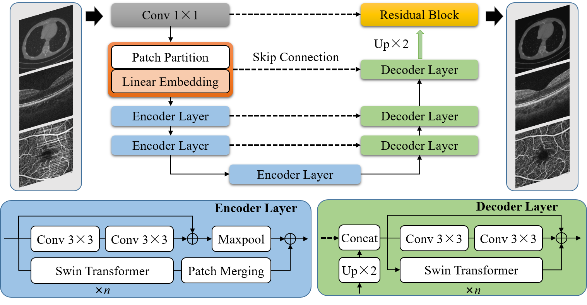

<span id="jump1"></span>
# StruNet: Perceptual and low-rank regularized transformer for medical image denoising


###  [Paper](https://doi.org/10.1002/mp.16550) | [BibTex](#jump2)

StruNet: Perceptual and low-rank regularized transformer for medical image denoising<br>

[Yuhui Ma](#jump1),  [Qifeng Yan](#jump1),  [Yonghuai Liu](#jump1),  [Jiang Liu](#jump1),  [Jiong Zhang](#jump1),  [Yitian Zhao](#jump1)<br>

### [License](https://github.com/iMED-Lab/StruNet/blob/master/LICENSE)

All rights reserved.

The code is released for academic research use only. For commercial use, please contact [yitian.zhao@nimte.ac.cn](#jump1).

## Condensed Abstract

Background: Various types of noise artifacts inevitably exist in some medical imaging modalities due to limitations of imaging techniques, which impair either clinical diagnosis or subsequent analysis. Recently, deep learning approaches have been rapidly developed and applied on medical images for noise removal or image quality enhancement. Nevertheless, due to complexity and diversity of noise distribution representations in different medical imaging modalities, most of the existing deep learning frameworks are incapable to flexibly remove noise artifacts while retaining detailed information. As a result, it remains challenging to design an effective and unified medical image denoising method that will work across a variety of noise artifacts for different imaging modalities without requiring specialized knowledge in performing the task. 

Purpose: In this paper, we propose a novel encoder-decoder architecture called Swin transformer-based residual u-shape Network (StruNet), for medical image denoising. 

Methods: Our StruNet adopts a well-designed block as the backbone of the encoder-decoder architecture, which integrates Swin T ransformer modules with residual block in parallel connection. Swin Transformer modules could effectively learn hierarchical representations of noise artifacts via self -attention mechanism in non-overlapping shifted windows and cross-window connection, while residual block is advantageous to compensate loss of detailed information via shortcut connection. Furthermore, perceptual loss and low-rank regularization are incorporated into loss function respectively in order to constrain the denoising results on feature-level consistency and low-rank characteristics. 

Results: To evaluate the performance of the proposed method, we have conducted experiments on three medical imaging modalities including computed tomography (CT), optical coherence tomography (OCT) and optical coherence tomography angiography (OCTA). 

Conclusions: The results demonstrate that the proposed architecture yields a promising performance of suppressing multiform noise artifacts existing in different imaging modalities. 

## Getting Started

Clone this repo
```
git clone https://github.com/iMED-Lab/StruNet.git
```

Install prerequisites
```
cd StruNet
pip install -r requirements.txt
```

Prepare your data

Please put the root directory of your dataset into the folder ./datasets. Then the subfolder for each dataset can be organized as follows. 

|-- datasets
    |-- CT
        |-- train
            |-- 1E4
            |-- high
        |-- test
            |-- 1E4
            |-- high
    |-- OCT
        |-- train
            |-- images
            |-- labels
        |-- test
            |-- images
            |-- labels
    |-- OCTA
        |-- train
            |-- low
            |-- high
        |-- test
            |-- low
            |-- high

## Run the code

### Start Visdom
```
    python -m visdom.server
```
### Training (Demo for CT dataset)
```
    python train.py --dataset CT --data_dir ./datasets/CT --name StruNet --isRes --isSwinT
```
### Testing (Demo for CT dataset)
```
    python test.py --dataset CT --data_dir ./datasets/CT --name StruNet --load_model best-best.pth
```


<span id="jump2"></span>
### Citation
If you use this code for your research, please cite our papers. 
```
@article{ma2023strunet,
  title={StruNet: Perceptual and low-rank regularized transformer for medical image denoising},
  author={Ma, Yuhui and Yan, Qifeng and Liu, Yonghuai and Liu, Jiang and Zhang, Jiong and Zhao, Yitian},
  journal={Medical Physics},
  year={2023},
  publisher={Wiley Online Library}
}
```
